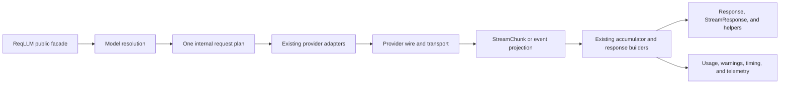

# ReqLLM Roadmap

> Discussion draft — July 16, 2026

ReqLLM should evolve in place. Its public API is useful, recognizable, and
widely deployed; popularity makes compatibility and predictable migration more
valuable than architectural purity. The default path is therefore additive
ReqLLM 1.x releases backed by stronger conformance evidence. A formal V2 should
happen only for a small set of high-return changes that cannot be delivered
honestly behind the current API.

This document is the roadmap index and shared product direction. Release-specific
scope lives in:

| Track | Compatibility posture | Roadmap | Master tracker |
| --- | --- | --- | --- |
| ReqLLM 1.x | Backward-compatible evolution | [ROADMAP_V1.md](ROADMAP_V1.md) | [#829](https://github.com/agentjido/req_llm/issues/829) |
| ReqLLM 2.0 | Intentional, bounded breaking changes | [ROADMAP_V2.md](ROADMAP_V2.md) | [#830](https://github.com/agentjido/req_llm/issues/830) |

The [V1 execution goal](V1_EXECUTION_GOAL.md) defines the one-issue delivery
loop, backward-compatibility merge gate, review and hardening standard, and
completion criteria for the V1 backlog.

The [ReqLLM 1.x compatibility policy](COMPATIBILITY.md) is the normative public
contract for stable, experimental, deprecated, platform, and ReqLLM/Jido
boundaries.

The V1 roadmap records the review of 42 proposed issues covering Milestones 0–8.
After auditing them against current `main`, 36 remain active one-pull-request
tickets, three are already satisfied by current code, two were consolidated into
stronger tickets, and one speculative middleware framework was deferred.
Execution takes one issue through merge and green post-merge checks before the
next issue begins.

## Product thesis

ReqLLM should be the dependable Elixir model-runtime layer:

- one small, stable API across providers and modalities;
- explicit behavior when provider capabilities differ;
- excellent errors, diagnostics, streaming, and observability;
- composable model and tool contracts for Jido and other orchestration hosts;
- provider-native escape hatches that do not contaminate the common API; and
- replay-backed evidence for every support claim.

The package should optimize for this boundary:

```text
ReqLLM: prompt -> one model interaction -> normalized result or tool calls
Jido:   orchestration -> approvals -> memory -> checkpointing -> durability
```

A developer should not have to abandon the simple API as their application
grows. ReqLLM's functional entry points and extension contracts remain the model
boundary. Jido or another host composes those calls into agent loops and durable
workflows.

## Compatibility vocabulary

- **V1 additive** — new API or internal behavior that does not invalidate
  supported callers.
- **V1 deprecation** — old behavior continues for a documented window with an
  actionable replacement and warning.
- **V1 bug fix** — documented or typed behavior was silently wrong. Correctness
  wins, with a release note and regression test.
- **V2 candidate** — a possible break that first needs an additive V1 migration
  path and adoption evidence.
- **V2 only** — removal or semantic replacement that must not ship in V1.

Compatibility includes more than top-level function arities. Treat these as
public contracts unless explicitly documented otherwise:

- return tuple and exception behavior;
- response, stream, message, tool, usage, and error shapes;
- stream element semantics and cancellation behavior;
- accepted model and option forms;
- provider callbacks used by third-party integrations;
- telemetry event names and metadata;
- fixture names and compatibility-state semantics; and
- documented configuration keys.

Adding struct fields may compile cleanly while still changing map equality,
`Map.from_struct/1`, `Inspect`, or JSON output. V1 therefore keeps existing
public struct shapes and serializers stable unless richer data is returned
through an explicitly opt-in value.

## Target architecture

The target is a thin compatibility facade over an inspectable planning and
execution kernel:



The boundaries mean:

- **Request plan** is one internal, prescriptive value containing the resolved
  model, operation, named API surface, normalized options, transport, and
  warnings. Separate profile, mode, surface, and policy types are introduced
  only if repeated implementation pressure proves they reduce complexity.
- **Provider adapters** keep the current `ReqLLM.Provider` contract working
  throughout V1.
- **Provider seams** are extracted only where they remove measured duplication;
  V1 does not create a protocol hierarchy for its own sake.
- **Event projection** derives richer events from the one consumable stream; it
  does not add a second independently consumed stream.
- **Materialization** consolidates the existing `ChunkAccumulator` and
  `ResponseBuilder` paths instead of introducing a parallel accumulator stack.
- Compatibility evidence informs support claims and tests, never live runtime
  routing.

These internals can arrive while the existing facade and provider behavior
remain available throughout V1.

## What to harvest

This roadmap combines four sources:

1. the current ReqLLM 1.17 architecture and public API;
2. reusable scenario work on origin/v2/reqllm-next-architecture at 893222c6;
3. architecture experiments in the separate reqllm_next prototype; and
4. ideas from Vercel AI SDK 7, released June 25, 2026.

| Source | Keep | Do not copy directly |
| --- | --- | --- |
| Closed architecture branch | Reusable capability scenarios, stable fixtures, semantic tags, scenario-level evidence, generated modality coverage | The test-only registry/runtime split, duplicated Mix-task mappings, and a large hand-maintained taxonomy |
| reqllm_next | Scenario contracts, explicit surface names, materializer tests, output-item experiments, support evidence, and focused provider slices | Its full profile/mode/surface/plan stack, a wholesale rewrite, a 230-module migration, mandatory compile-time manifests, a higher Elixir floor without product need, or Spec Led/Spark runtime requirements |
| Vercel AI SDK 7 | Stable functional generation, structured outputs on text generation, rich stream parts, normalized tool contracts, timeouts, telemetry integrations, and provider metadata | Agent loops, approvals, workflow durability, JavaScript UI protocols, or experimental harness/sandbox abstractions in ReqLLM core |

The closed branch should be mined commit by commit, not reopened or merged. The
prototype is a design laboratory and executable reference, not the future
package tree.

## Decision rule for V2

Do not create V2 merely because internals change. A proposed break must satisfy
all of these:

1. it removes silent wrongness, unlocks a major capability, or materially lowers
   ongoing provider maintenance;
2. an additive API would leave two confusing long-lived ways to do the same
   thing;
3. migration is mechanical and can be documented or checked automatically;
4. a working V1 bridge has been available for at least two minor releases; and
5. the accepted breaks form a coherent release rather than an isolated cleanup.

Until that threshold is met, use adapters, opt-in policies, and deprecations.

## Product metrics

- percentage of first-class models with current scenario evidence;
- buffered-stream versus non-stream semantic parity rate;
- percentage of unsupported or ignored options producing a warning or error;
- median time to diagnose fixture/live provider failures by layer;
- provider additions that require shared-core branching;
- deprecation adoption and remaining legacy call sites in public examples;
- time to first working call from a new project;
- percentage of errors with a remediation and correlation ID;
- Jido integrations requiring no provider-specific response branching; and
- compatibility issues per minor release.

## Decisions needed

1. Should the next year prioritize model-runtime reliability, the Jido extension
   contract, or provider/modality breadth? Recommendation: reliability first,
   Jido extensions second, breadth third.
2. Is implementing ReqLLM.Provider a formally supported public extension surface
   or package-internal despite being callable?
3. Should V1 normalize structured-output failures to warnings, or preserve each
   provider's current default while offering strict opt-in validation?
4. Should a legacy StreamChunk projection remain for the full V2 release line?
5. Should the Jido adapter live in Jido or a separately versioned optional
   integration package? Recommendation: Jido unless release cadence proves
   painful.
6. Is two minor releases enough for deprecation, or should popular APIs receive
   six months plus two minors?
7. Which Elixir and OTP support window reflects the current user base?

## External references

The Vercel ideas were reviewed from official sources on July 16, 2026:

- [AI SDK 7 announcement](https://vercel.com/blog/ai-sdk-7)
- [AI SDK 7 detailed changelog](https://vercel.com/changelog/ai-sdk-7)
- [AI SDK 7 migration guide](https://ai-sdk.dev/docs/migration-guides/migration-guide-7-0)
- [AI SDK tool calling](https://ai-sdk.dev/docs/ai-sdk-core/tools-and-tool-calling)
- [AI SDK structured output](https://ai-sdk.dev/docs/ai-sdk-core/generating-structured-data)
- [AI SDK streaming result](https://ai-sdk.dev/docs/reference/ai-sdk-core/stream-text)

The relevant lesson is not API-name parity or copying Vercel's agent runtime. It
is the value of stable functional generation, rich tool/result contracts,
timeouts, and observability beneath orchestration. ReqLLM should provide that
model boundary; Jido should own the loop.
